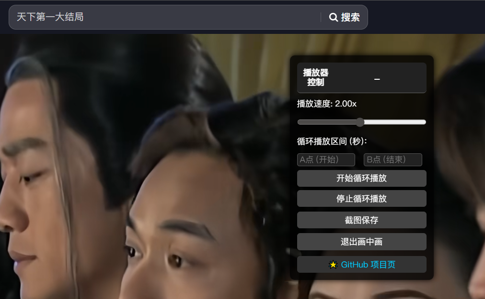

# douyin-enhancer 🎬

> 一个轻量级的 douyin 视频增强插件，提供播放速度调节、AB 区间循环播放、画中画、截图保存等实用功能，助你更高效地学习和娱乐！

## 🚀 功能介绍

- 🎚 **播放速度调节**：支持 `0.1x ~ 4x` 范围内任意调速，学习更高效。
- 🔁 **AB 循环播放**：自定义起止时间段，循环播放选中区间，便于背诵/听力训练。
- 📷 **一键截图保存**：将当前视频画面保存为本地 PNG 图片。
- 🖼 **画中画播放（PiP）**：视频悬浮播放，自由切换页面也不影响观看。
- 🧩 **悬浮面板**：面板可自由拖动，支持最小化折叠收起。

## 📦 安装方法

### 本地加载（开发者模式）
1. 下载本插件源码，解压得到文件夹 `douyin-enhancer`
2. 打开 Chrome，访问地址栏输入：`chrome://extensions/`
3. 开启右上角的「开发者模式」
4. 点击「加载已解压的扩展程序」，选择插件目录
5. 完成安装，访问 [https://www.douyin.com/](https://www.douyin.com/) 即可看到右上角悬浮面板

## 🧑‍💻 使用方法

1. 打开任意 douyin 视频页面
2. 右上角会出现悬浮控制面板，包含：
   - 播放速度滑块
   - 设置 AB 循环起止时间（按钮）
   - 开启画中画模式
   - 视频截图保存
3. 拖动面板顶部可随意移动位置，点击折叠按钮可隐藏面板内容

## 🖼️ 截图

## 📌 注意事项

- 插件仅在 douyin 视频页面生效（域名包含 `douyin.com`）。
- 画中画功能依赖浏览器原生支持（需在支持 HTML5 的视频页面）。
- 如果面板未显示，尝试刷新页面或确认视频已加载完毕。

## 🙌 支持与反馈

如果你喜欢这个插件，欢迎 Star、Fork 或提出功能建议。  
你也可以通过 Issues 提交问题或优化建议。
